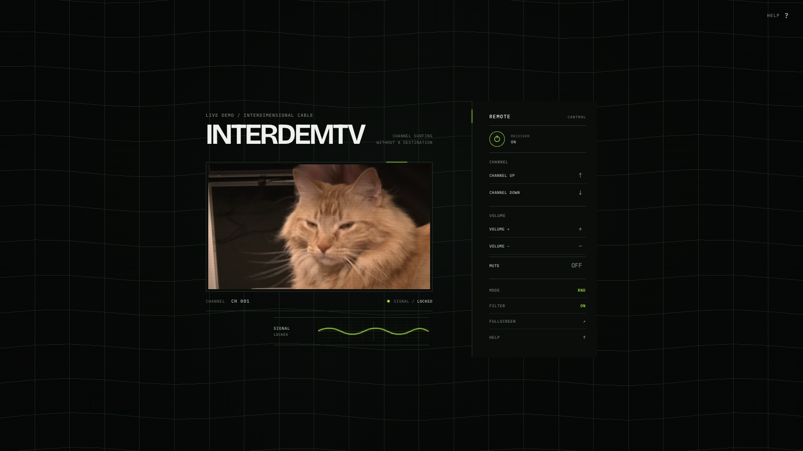
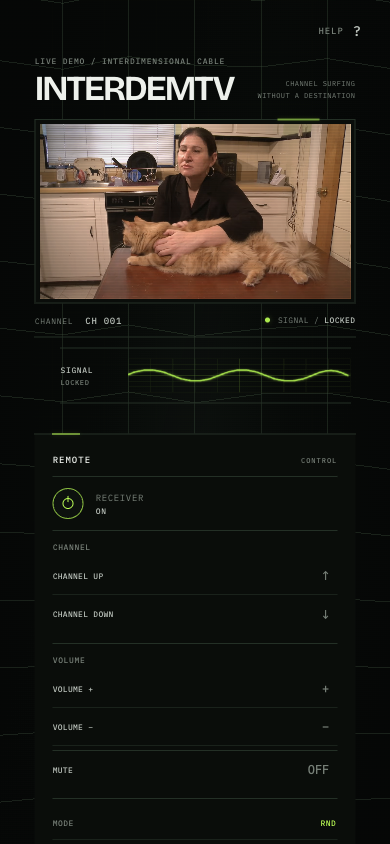

# InterDemTV

**Channel surfing without a destination.**

InterDemTV is an experimental browser-based television for wandering through strange corners of the internet.

[Live Demo](https://tv.yliu.tech/)



## What is InterDemTV?

InterDemTV recreates channel surfing in the browser with channels drawn from YouTube-hosted videos. Browse at random or move through the lineup in order, with CRT-inspired visuals, signal behavior, and a dedicated remote. It is a non-commercial personal experiment.

## Features

- Random or sequential channel surfing; RND mode can start longer videos at a random point
- CRT filters and power/channel transitions
- Signal oscilloscope and receiver state feedback
- Volume and mute controls, keyboard navigation, and fullscreen support
- Responsive desktop and mobile layouts
- Progressive visual fallbacks for older, limited, or Smart TV browser engines, with an optional WebGL environment enhancement

The mobile layout keeps the receiver and its controls together on smaller screens.



## Controls

| Action | Remote | Keyboard |
| --- | --- | --- |
| Power | POWER | Space |
| Next channel | CHANNEL UP | ↑ |
| Previous channel | CHANNEL DOWN | ↓ |
| Volume up | VOLUME + | → |
| Volume down | VOLUME − | ← |
| Mute | MUTE | M |
| Toggle fullscreen | FULLSCREEN | F |
| Toggle CRT filter | FILTER | T |
| Help | HELP | ? |

Use **MODE** to switch between **RND** and **SEQ** navigation.

## How it works

The app uses vanilla HTML, CSS, and JavaScript with the YouTube IFrame Player API. `videos.json` is the canonical channel list. An optional Three.js/WebGL environment enhances the scene, with CSS and static visual fallbacks when module or WebGL support is unavailable. A Service Worker caches static assets and provides offline fallback behavior.

## Run locally

```bash
python3 -m http.server
```

Then open the local address printed by the server.

## Notes

Videos remain hosted by YouTube and belong to their respective owners. InterDemTV does not rehost them.
